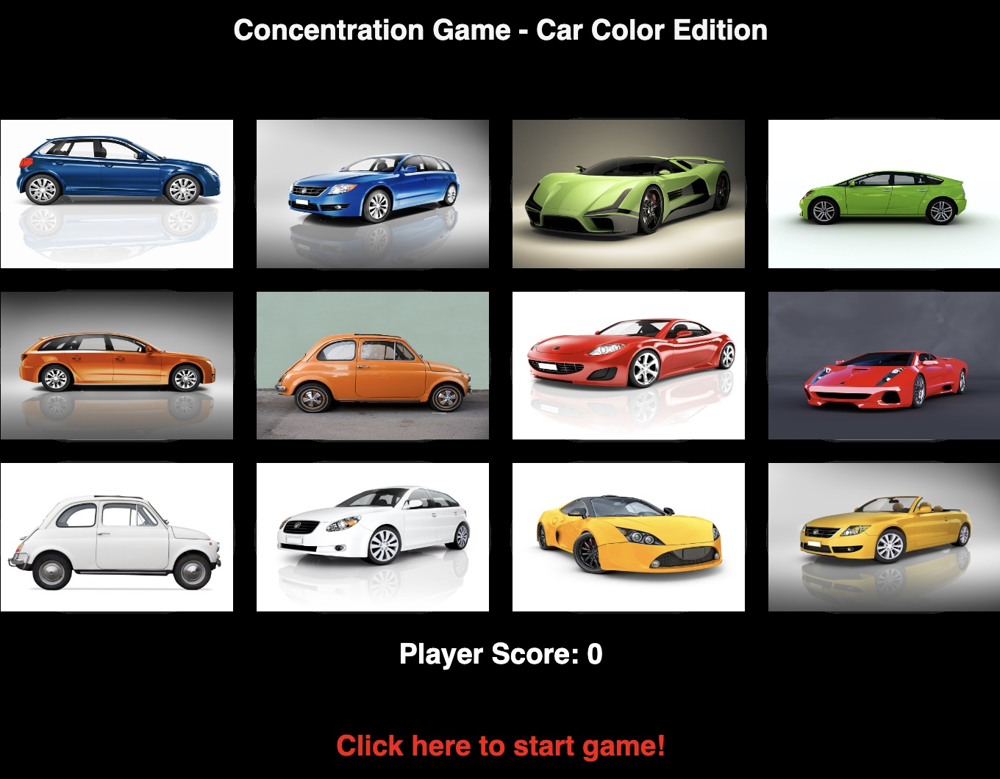

# Concentration Game - Car Color Edition

### My game choice for project 1 will be a Concentration game, which will use pictures of cars with specific colors. 

## Wireframe 




## PsuedoCode
```
function showImages() {
-show the images on the gameboard
}


function hideImages() {
-hide the images on the gameboard
}


function renderBoard() {
-show the car images for 2 seconds, and then call hideImages function
}


function initialize() {
-Reset player score to 0 and then call renderboard function
}

function checkForPairs() {
-Check whether the two images that were consecutively clicked by the user/player matches, which will result in a winning condition 
}
