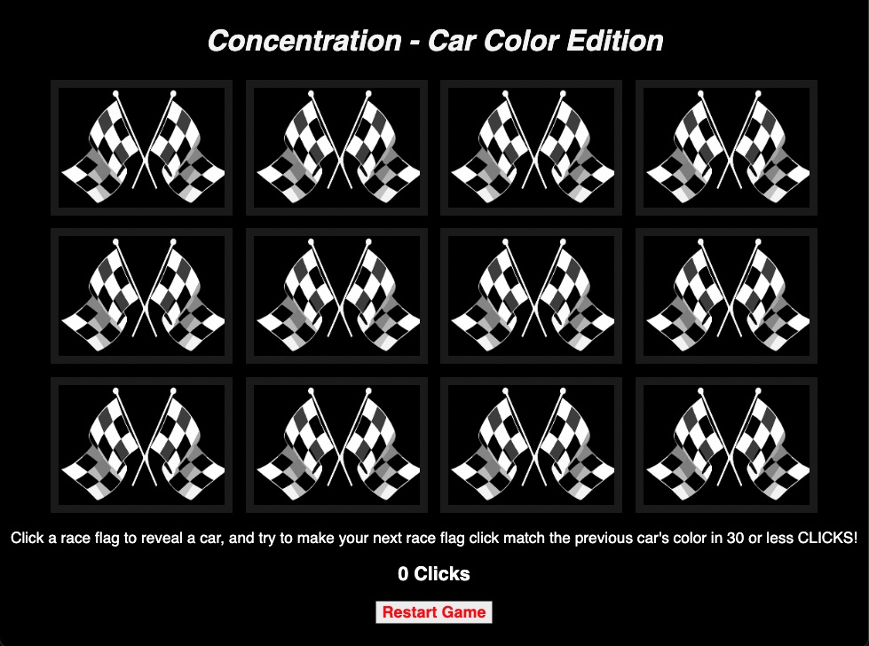

# **Concentration Game - Car Color Edition**

### ***My game choice for Project 1 is a Concentration/Memory type game, which will use images of pairs of cars that have the same color!***
&nbsp;
## **Game Rules:**
1. There are a total of 12 cars with 6 pairs of the same color
2. On page load these 12 cars will be hidden and replaced with pictures of race flags in tiles
3. After a player clicks their first race flag tile, a car will appear and persist until the next race flag tile is clicked, which will then show another car.
4. If the second race flag tile that is clicked reveals a car that doesn't match the previously clicked car's color, then both cars will be hidden once again
4. The goal is for the player to consecutively click on race flag tiles that reveals two of the same colors of cars in under 30 clicks!
&nbsp;
## **Game Pictures:**

&nbsp;
## **Technologies Used:**
- HTML
- CSS
- Vanilla Javascript
&nbsp;
## **Getting Started:**
&nbsp;
Link to the game: <https://ronnepuzondev.github.io/concentration-game-car-color-edition/>
&nbsp;
## **Next Steps:**
&nbsp;
Future Enhancements will include: 
- Hard Mode (less than 30 clicks)
- Mobile browser compatibility
- Add more sounds
